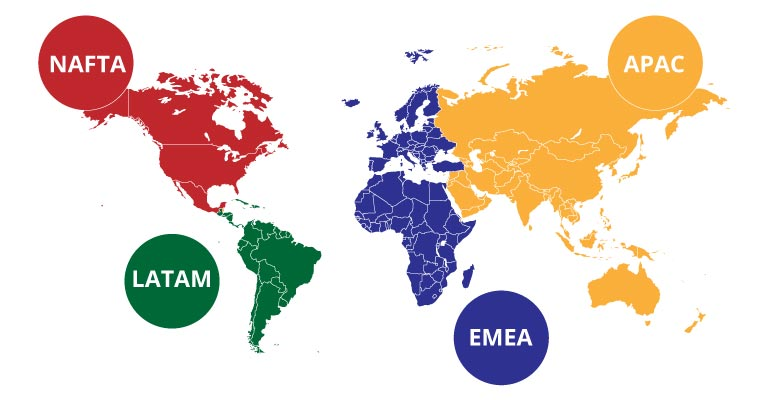

# STEM-Iniciatives
The STEM education fosters creativity and divergent thinking alongside fundamental disciplines. It motivates and inspires young people to generate new technologies and ideas. Industry support for STEM iniciatives can build bridges to reduce gaps. This list shows and makes visible non-profit communities that volunteer and offer free training to their community in person or virtually or offer scholarships for underrepresented groups in STEM areas.

## Who am I?

Ever since I was a child I fell in love with robots, education and communication. All that put together led me to become an active and passionate volunteer in different Tech Women Communities. I am working as software developer in [Ekumen](https://www.ekumenlabs.com/) and I am a teacher at  [Roberto Rocca Technical High School](http://www.tecnicarobertorocca.edu.ar/).

## Goals :
- To support skills development for underrepresented talent
- To make organizations aware of the need for programs to engage young women who choose STEM fields
- To support tech women communities
- To offer valuable mentoring opportunities

## The content is organized as follows:

The initiatives are grouped according to geographical areas. Each initiative may also include a brief description, the country where the activities are carried out and the link to their website.

## Underrepresented communities:

If you know a community that you would like to mention, highlight an underrepresented group in technology, do not hesitate to mention it, it is important to make volunteer work visible and strengthen these communities that serve as foundations for the STEM world

## Ways to collaborate:
- Share this repository with other people who want to help or support these communities
- Make a PR (pull request) with information from a technical underrepresented community that you would like to see featured or a project from a non-profit organization that supports STEM education ( Name of project, Description,Country, Link) 
- Just sent me a email to belentorr28@gmail.com with a link of a STEM Project, the subject should be Stem initiatives.

## Memes
Feel free to generate a meme with this [page](https://www.crearmemes.es/) about things that you have heard absurd or things that you think are necessary to be communicated

