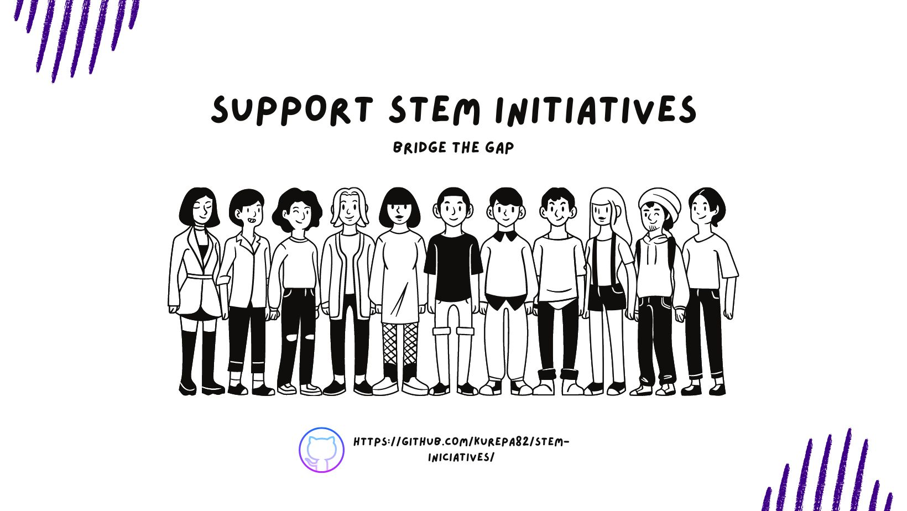

# STEM-Iniciatives
The STEM education fosters creativity and divergent thinking alongside fundamental disciplines. It motivates and inspires young people to generate new technologies and ideas. Industry support for STEM iniciatives can build bridges to reduce gaps. 

## Who am I?

Ever since I was a child I fell in love with robots, education and communication. All that put together led me to become an active and passionate volunteer in different Tech Women Communities. I am working as software developer in Ekumen [Ekumen Website](https://www.ekumenlabs.com/) and I am a teacher in a Technical High School [ETRR](http://www.tecnicarobertorocca.edu.ar/)

## Goals :
wip

